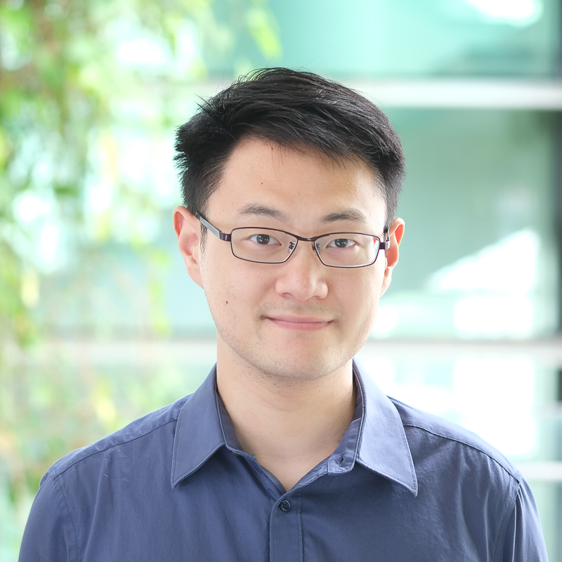

## About Me

I am currently a research fellow at TUMCREATE, Singapore. 

I have been heavily involved in a number of local (Singapore) and international (collaborating with research entities in Germany and China) research projects.

## Education

2007 - 2011	B.Eng.		Shanghai Jiao Tong University
2011 - 2013	M.Sc.		Technical University of Munich (TUM)
2016 - 2022	Ph.D 		Technical University of Munich (TUM)

## Research Interests

My research interests include high-performance computing with a special focus on using heterogeneous hardware to accelerate agent-based simulations, general agent-based modeling & simulation, and smart transportation problems.

## Research Projects

### [Singapore Integrated Transport and Energy Model (SITEM)](https://www.tum-create.edu.sg/content/sitem-singapore-integrated-transport-and-energy-model)
A\*STAR’s Institute of High Performance Computing (IHPC) and TUMCREATE Ltd (TUMCREATE) are working together on a research project that supports Singapore’s planning for the transition to electric vehicles (EVs) nationwide. The Singapore Integrated Transport Energy Model (SITEM) will be used to conduct a comprehensive analysis of projected electric vehicle (EV) charging patterns and energy demand, which will support policymaking on Singapore’s budget 2040 vision for all vehicles to run on cleaner energy and contribute towards Singapore’s decarbonisation commitments. The research project is commissioned by the Science and Technology Policy and Plans Office (S&TPPO), Prime Minister’s Office, and aims to advance the nation’s capabilities in integrated modelling and simulation of transport and power systems.

### [TUMCREATE Virtual Interactive Lab](https://ars.electronica.art/futurelab/en/projects-tumcreate/)
Collaborating with Future lab at ARS Electronica (Linz, Austria) to develop a unique research and demonstrator platform for urban mobility - which merges the interdisciplinary scientific expertise of TUMCREATE with the available technology for virtual reality.

## Publications

[1] Ran Bi, Jiajian Xiao, Dominik Pelzer, David Ciechanowicz, David Eckhoff, and Alois C. Knoll. 2017. A simulation-based heuristic for city-scale electric vehicle charging station placement. In 20th IEEE International Conference on Intelligent Transportation Systems, ITSC 2017, Yokohama, Japan, October 16-19, 2017, IEEE, 1–7. DOI:https://doi.org/10.1109/ITSC.2017.8317680

[2] Ran Bi, Jiajian Xiao, Vaisagh Viswanathan, and Alois C. Knoll. 2016. Influence of Charging Behaviour Given Charging Station Placement at Existing Petrol Stations and Residential Car Park Locations in Singapore. In International Conference on Computational Science 2016, ICCS 2016, 6-8 June 2016, San Diego, California, USA (Procedia Computer Science), Elsevier, 335–344. DOI:https://doi.org/10.1016/j.procs.2016.05.347

[3] Ran Bi, Jiajian Xiao, Vaisagh Viswanathan, and Alois C. Knoll. 2017. Influence of charging behaviour given charging infrastructure specification: A case study of Singapore. J. Comput. Sci. 20, (2017), 118–128. DOI:https://doi.org/10.1016/j.jocs.2017.03.013

[4] Dominik Pelzer, Jiajian Xiao, Daniel Zehe, Michael Harold Lees, Alois C. Knoll, and Heiko Aydt. 2015. A Partition-Based Match Making Algorithm for Dynamic Ridesharing. IEEE Trans. Intell. Transp. Syst. 16, 5 (2015), 2587–2598. DOI:https://doi.org/10.1109/TITS.2015.2413453

[5] Khatereh Polous, Jukka Matthias Krisp, Liqiu Meng, Bibek Shrestha, and Jiajian Xiao. 2015. OpenEventMap: A Volunteered Location-Based Service. Cartogr. Int. J. Geogr. Inf. Geovisualization 50, 3 (2015), 248–258. DOI:https://doi.org/10.3138/cart.50.4.3130

[6] Jiajian Xiao. 2020. Reproducibility Report for the Paper: Approximated Rollbacks. In Proceedings of the 2019 ACM SIGSIM Conference on Principles of Advanced Discrete Simulation, SIGSIM-PADS 2020, Miami, FL, USA, June 15-17, 2020, ACM, 35–37. DOI:https://doi.org/10.1145/3384441.3396229

[7] Jiajian Xiao, Philipp Andelfinger, Wentong Cai, David Eckhoff, and Alois C. Knoll. 2021. OptCL: A Middleware to Optimise Performance for High Performance Domain-Specific Languages on Heterogeneous Platforms. In Algorithms and Architectures for Parallel Processing - 21st International Conference, ICA3PP 2021, Virtual Event, December 3-5, 2021, Proceedings, Part III (Lecture Notes in Computer Science), Springer, 772–791. DOI:https://doi.org/10.1007/978-3-030-95391-1\_48

[8] Jiajian Xiao, Philipp Andelfinger, Wentong Cai, Paul Richmond, Alois C. Knoll, and David Eckhoff. 2019. Advancing Automatic Code Generation for Agent-Based Simulations on Heterogeneous Hardware. In Euro-Par 2019: Parallel Processing Workshops - Euro-Par 2019 International Workshops, Göttingen, Germany, August 26-30, 2019, Revised Selected Papers (Lecture Notes in Computer Science), Springer, 308–319. DOI:https://doi.org/10.1007/978-3-030-48340-1\_24

[9] Jiajian Xiao, Philipp Andelfinger, Wentong Cai, Paul Richmond, Alois C. Knoll, and David Eckhoff. 2020. OpenABLext: An automatic code generation framework for agent-based simulations on CPU-GPU-FPGA heterogeneous platforms. Concurr. Comput. Pract. Exp. 32, 21 (2020). DOI:https://doi.org/10.1002/cpe.5807

[10] Jiajian Xiao, Philipp Andelfinger, David Eckhoff, Wentong Cai, and Alois C. Knoll. 2018. Exploring Execution Schemes for Agent-Based Traffic Simulation on Heterogeneous Hardware. In 22nd IEEE/ACM International Symposium on Distributed Simulation and Real Time Applications, DS-RT 2018, Madrid, Spain, October 15-17, 2018, IEEE Computer Society, 243–252. DOI:https://doi.org/10.1109/DISTRA.2018.8601016

[11] Jiajian Xiao, Philipp Andelfinger, David Eckhoff, Wentong Cai, and Alois C. Knoll. 2018. A Survey on Agent-based Simulation using Hardware Accelerators. CoRR abs/1807.01014, (2018). Retrieved from http://arxiv.org/abs/1807.01014

[12] Jiajian Xiao, Philipp Andelfinger, David Eckhoff, Wentong Cai, and Alois C. Knoll. 2019. A Survey on Agent-based Simulation Using Hardware Accelerators. ACM Comput. Surv. 51, 6 (2019), 131:1-131:35. DOI:https://doi.org/10.1145/3291048

[13] Jiajian Xiao, Heiko Aydt, Michael Lees, and Alois C. Knoll. 2013. A partition based match making algorithm for taxi sharing. In 16th International IEEE Conference on Intelligent Transportation Systems, ITSC 2013, The Hague, The Netherlands, October 6-9, 2013, IEEE, 2393–2400. DOI:https://doi.org/10.1109/ITSC.2013.6728585

[14] Jiajian Xiao, Görkem Kilinç, Philipp Andelfinger, David Eckhoff, Wentong Cai, and Alois C. Knoll. 2020. Pedal to the Bare Metal: Road Traffic Simulation on FPGAs Using High-Level Synthesis. In Proceedings of the 2019 ACM SIGSIM Conference on Principles of Advanced Discrete Simulation, SIGSIM-PADS 2020, Miami, FL, USA, June 15-17, 2020, ACM, 117–121. DOI:https://doi.org/10.1145/3384441.3395979

## Honors

Year | Award | Awarding Entity
-----|-------|--------
2018 | Best Paper Award  | IEEE/ACM DS-RT 2018 
2022 | FireFly Silver Borderless Award | Ministry of Trade and Industry (MTI), Singapore

